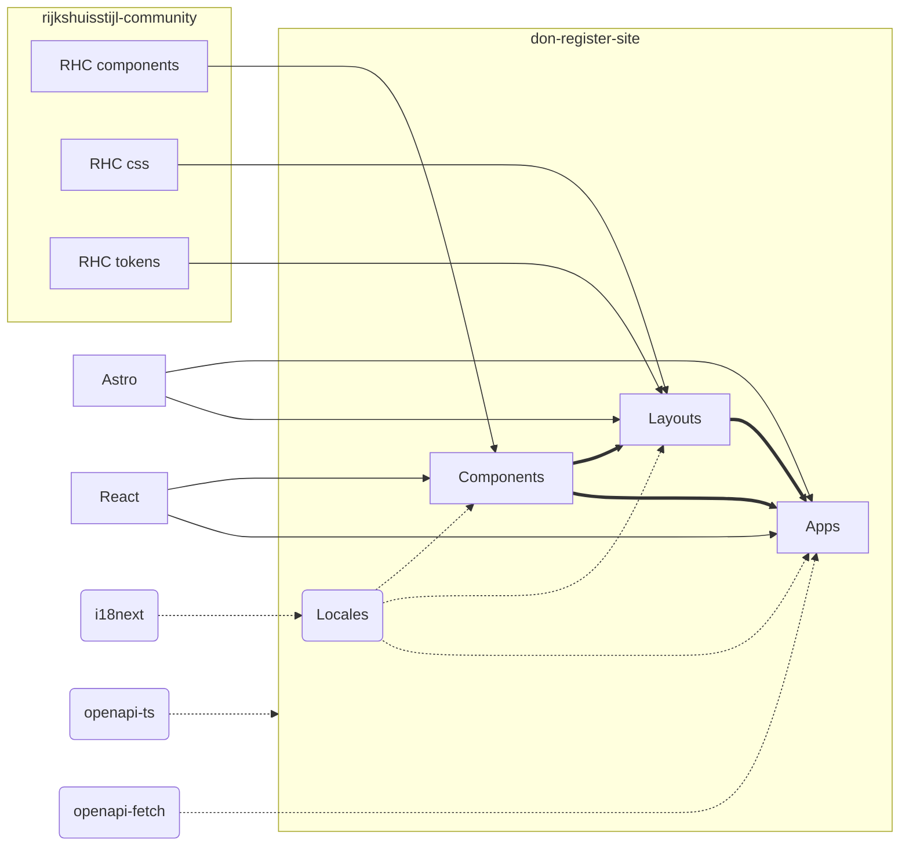

# developer.overheid.nl Register Site(s)

> De website(s) van het OSS- en API-register van developer.overheid.nl.

Deze monorepo bevat de *nieuwe* websites van het [API-register](https://apis.developer.overheid.nl) en binnenkort ook het [OSS-register](https://oss.developer.overheid.nl).
De codebase bestaat uit een aantal packages die de gezamelijke codebase (components, layouts, etc) vormen en een `apps`-package waarin de verschillende websites staan.

## Packages

### Components

De package `components` bevat de generieke React componenten voor de sites. Deze zijn gebaseerd op de [Rijkshuisstijl Community Componenten](https://github.com/nl-design-system/rijkshuisstijl-community).  
Deze package zal gepubliceerd worden op [NPM]

### Layouts

De package `layouts` bevat de (generieke) Astro layouts voor de sites. Op dit moment zitten ze in de map `don` zodat er evt andere organisaties bij kunnen komen. Dit kan veranderen.  
Deze package bevat ook een aantal helper-scripts.  
Deze package zal gepubliceerd worden op [NPM]

### Locales

De packages `locales` bevat het localization-bestand voor de (kleine) teksten op de site. Dit is op basis van [i18next](https://www.i18next.com/).  
Op dit moment is er maar 1 locale beschikbaar, namelijk Nederlands (`nl/translation.json`), mogelijk dat er in de toekomst meer talen beschikbaar komen. De `apps` en andere packages kunnen dan aangepast worden met taaldetectielogica.  
Deze package zal gepubliceerd worden op [NPM]

## Apps

### API-register

> Dit is het API-register van de Nederlandse overheid (bèta): alle API’s op één plek.  
> [apis.developer.overheid.nl](https://apis.developer.overheid.nl)

De [Astro] site van het API-register.

Zie ook de [README](/apps/api-register/README.md) van deze package.

### TBD: OSS-register

TODO: De [Astro] site van het OSS-register.

### TBD: Demo

TODO: een template site die gekloond kan worden door andere organisaties, waarin uitgelegd kan worden hoe de opzet veranderd kan worden etc.

## Overige mappen en bestanden

### Proprietary

De map `proprietary` bevat bestanden die niet zomaar gebruikt mogen worden, zoals logo's, fonts en iconen.  
Deze "package" zal ook niet gepubliceerd worden op NPM.  
TODO: Een generieke optie aanbieden...  
TODO: fix linking naar packages

### Types

Typescript declarations.

### redocly.yaml

Het bestand `redocly.yaml` bevat de OpenApiSpecification-configuratie van de API's van de apps. Als er een nieuwe app wordt toegevoegd kan hier de OAS toegevoegd worden. Met `pnpm ts:oas` wordt een typescript declaration aangemaakt op basis van de OAS.  
Hiervoor wordt [OpenAPI TypeScript](https://openapi-ts.dev/) gebruikt en de apps maken gebruik van [openapi-fetch](https://openapi-ts.dev/openapi-fetch/) waardoor de inhoud van de API direct de correcte types heeft.

## Structuur

## (Dev)Dependencies

- Astro: Site build, routing, SSR / SSG
- React: Components
- i18Next: Localisation
- Typescript
- Vite
- OpenAPI TypeScript: Type declarations & fetch
- RijkshuisstijlCommunity: React Components
- Biome: formatting, linting and assist

## Formatting and Linting

Deze repository maakt gebruik van [Biome] voor formatting en linting. Download de VSCode extensie:   
Als code styleguide kijken we naar de default settings en de [Google Style Guides](https://google.github.io/styleguide/) voor inspiratie.
Voor Astro-bestanden zijn een aantal features uitgezet om false positives te voorkomen.

## Contact

[💬 Slack](https://codefornl.slack.com/archives/CFV4B3XE2)  •&nbsp;
[🐘 Mastodon](https://social.overheid.nl/@developer)  •&nbsp;
[👔 LinkedIn](https://www.linkedin.com/company/92926607)  •&nbsp;
[📨 Schiet een issue in](https://github.com/developer-overheid-nl/don-register-site/issues) •&nbsp;
[🔀 Github Discussions](https://github.com/orgs/developer-overheid-nl/discussions)  •&nbsp;
[📜 Bijdragen](https://developer.overheid.nl/contributing)

---

## 🧞 Commands

All commands are run from the root of the project, from a terminal:

| Command                   | Action                                           |
| :------------------------ | :----------------------------------------------- |
| `pnpm install`             | Installs dependencies                            |
| `pnpm dev`             | Starts local dev server at `localhost:4321`      |
| `pnpm build`           | Build your production site to `./dist/`          |
| `pnpm preview`         | Preview your build locally, before deploying     |
| `pnpm astro ...`       | Run CLI commands like `astro add`, `astro check` |
| `pnpm astro -- --help` | Get help using the Astro CLI                     |

[Astro]: https://astro.build/
[Biome]: https://biomejs.dev/
[NPM]: https://www.npmjs.com/
