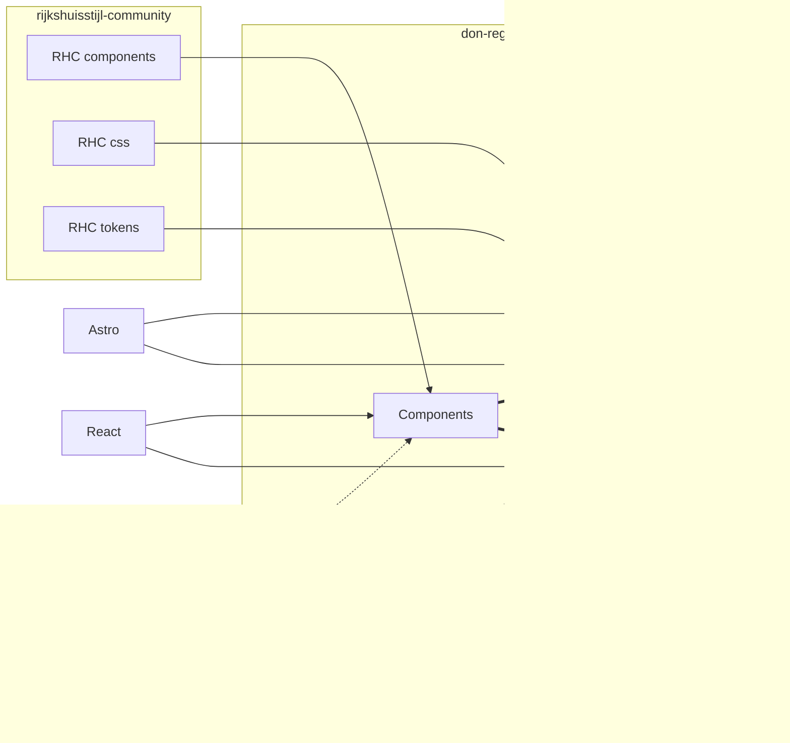

# developer.overheid.nl Register Sites

> De websites en packages van het OSS- en API-register van developer.overheid.nl en het [register-site-template].


[](https://biomejs.dev)


Deze monorepo bevat de *nieuwe* websites van het [API-register](https://apis.developer.overheid.nl) en het [OSS-register](https://oss.developer.overheid.nl).
De codebase bestaat uit een aantal packages die de gezamelijke codebase (components, layouts, etc) vormen en een `apps`-package waarin de verschillende websites staan. Deze packages worden ook gebruikt in het [register-site-template].

## Packages

### Components

De package `components` bevat de generieke React componenten voor de sites. Deze zijn gebaseerd op de [Rijkshuisstijl Community Componenten](https://github.com/nl-design-system/rijkshuisstijl-community).  
Deze package wordt gepubliceerd op [NPM]: <https://www.npmjs.com/package/@developer-overheid-nl/don-register-components>

### Layouts

De package `layouts` bevat de (generieke) Astro layouts voor de sites. Op dit moment zitten ze in de map `don` zodat er evt andere organisaties bij kunnen komen. Dit kan veranderen.  
Deze package bevat ook een aantal helper-scripts.  
Deze package wordt gepubliceerd op [NPM]: <https://www.npmjs.com/package/@developer-overheid-nl/don-register-layouts>

### Locales

De packages `locales` bevat het localization-bestand voor de (kleine) teksten op de site. Dit is op basis van [i18next](https://www.i18next.com/).  
Op dit moment is er maar 1 locale beschikbaar, namelijk Nederlands (`nl/translation.json`), mogelijk dat er in de toekomst meer talen beschikbaar komen. De `apps` en andere packages kunnen dan aangepast worden met taaldetectielogica.  
Deze package wordt gepubliceerd op [NPM]: <https://www.npmjs.com/package/@developer-overheid-nl/don-register-locales>

## Apps

### API-register

> Dit is het API-register van de Nederlandse overheid (bèta): alle API’s op één plek.  
> [apis.developer.overheid.nl](https://apis.developer.overheid.nl)

De [Astro] site van het API-register.

Zie ook de [README](https://github.com/developer-overheid-nl/don-register-site/blob/main/apps/api-register/README.md) van deze package.

### OSS-register

> Dit is het vernieuwde OSS-register van de Nederlandse overheid (bèta): alle open source repositories op één plek.  
> [oss.developer.overheid.nl](https://oss.developer.overheid.nl)

De [Astro] site van het OSS-register.

### Je eigen register

In de repository [register-site-template] staat een template voor het bouwen van sites op basis van de packages in deze monorepo.

## Overige mappen en bestanden

### Proprietary-*

De map `proprietary-example` bevat voorbeeldbestanden voor bestanden waar meestal een copyright op zit, zoals logo's, fonts en iconen. Dit zijn rechtenvrije bestanden, die in het register-template gebruikt kunnen worden als voorbeeld. Deze package wordt ook gepubliceerd op [NPM]: <https://www.npmjs.com/package/@developer-overheid-nl/proprietary-example>  
De map `proprietary-don` bevat bestanden voor onze eigen register-sites die niet zomaar gebruikt mogen worden, zoals logo's, fonts en iconen. Dit zal ook niet gepubliceerd worden op NPM.  

Om onze eigen `proprietary-don` package te registreren wordt in de `package.json` een alias toegevoegd, bijvoorbeeld:

```json
{
  "dependencies": {
    "@developer-overheid-nl/proprietary": "workspace:@developer-overheid-nl/proprietary-don@*"
  }
}
```

Op dezelfde manier wordt in de [register-site-template] een alias toegevoegd, maar dan naar het `proprietary-example` package:

```json
{
  "dependencies": {
    "@developer-overheid-nl/proprietary": "workspace:@developer-overheid-nl/proprietary-example@*"
  }
}
```

En kan er naar een eigen implementatie verwezen worden in de eigen register-site.  
In de codebase wordt er dus altijd verwezen naar `@developer-overheid-nl/proprietary`.

### Types

Typescript declarations.

### redocly.yaml

Het bestand `redocly.yaml` bevat de OpenApiSpecification-configuratie van de API's van de apps. Als er een nieuwe app wordt toegevoegd kan hier de OAS toegevoegd worden. Met `pnpm ts:oas` wordt een typescript declaration aangemaakt op basis van de OAS.  
Hiervoor wordt [OpenAPI TypeScript](https://openapi-ts.dev/) gebruikt en de apps maken gebruik van [openapi-fetch](https://openapi-ts.dev/openapi-fetch/) waardoor de inhoud van de API direct de correcte types heeft.

Er worden schema's gemaakt voor zowel de productie- als test-API's, in het bestand `api-schema.ts` kan je aangeven welke schema gebruikt wordt. Standaard staat deze op de productie-API, wil je tegen de test-API ontwikkelen, pas dit bestand dan aan. Ook bij deployen naar test is het aan te raden deze aan te passen. Een check in de CI-pipeline zorgt ervoor dat alleen de productie-API schema's gemerged kunnen worden naar `main`.

## Structuur


```mermaid
graph LR
    subgraph don-register-site
        C[Components] ==> L[Layouts] & A[Apps]
        L ==> A
        I(Locales) -.-> C & L & A
    end
    subgraph rijkshuisstijl-community
        Rcomp[RHC components] ---> C 
        Rcss[RHC css] ----> L 
        Rtokens[RHC tokens] ----> L
    end
    Astro ----> A & L
    React ---> C & A
    i18n(i18next) -.-> I
    oasts(openapi-ts) -..-> don-register-site
    oasfetch(openapi-fetch) -....-> A
```

## (Dev)Dependencies

- Astro: Site build, routing, SSR / SSG
- React: Components
- i18Next: Localisation
- Typescript
- Vite
- OpenAPI TypeScript: Type declarations & fetch
- RijkshuisstijlCommunity: React Components
- Biome: formatting, linting and assist
- Changesets, manage versioning and changelogs

## Formatting and Linting

Deze repository maakt gebruik van [Biome] voor formatting en linting. Download de VSCode extensie: [](vscode:extension/biomejs.biome)  
Als code styleguide kijken we naar de default settings en de [Google Style Guides](https://google.github.io/styleguide/) voor inspiratie.
Voor Astro-bestanden zijn een aantal features uitgezet om false positives te voorkomen.

## Versionering en Changelogs

Voor de publieke packages wordt gebruik gemaakt van [Changesets](https://changesets-docs.vercel.app/) voor het bijhouden van versies en changelogs.  
Versienummering volgt [SemVer](https://semver.org/), waarbij ook bij mogelijke (visuele) brekende wijzigingen een major-versie wordt uitgebracht.  
Zie ook de [README](https://github.com/developer-overheid-nl/don-register-site/blob/main/.changeset/README.md) in de `.changeset`-map hoe het werkt en de [CHANGELOG](https://github.com/developer-overheid-nl/don-register-site/blob/main/CHANGELOG.md) van de packages.

## Contact

[💬 Slack](https://codefornl.slack.com/archives/CFV4B3XE2)  •&nbsp;
[🐘 Mastodon](https://social.overheid.nl/@developer)  •&nbsp;
[👔 LinkedIn](https://www.linkedin.com/company/92926607)  •&nbsp;
[📨 Schiet een issue in](https://github.com/developer-overheid-nl/don-register-site/issues) •&nbsp;
[🔀 Github Discussions](https://github.com/orgs/developer-overheid-nl/discussions)  •&nbsp;
[📜 Bijdragen](https://developer.overheid.nl/contributing)

---

## 🧞 Commands

All commands are run from the root of the project, from a terminal:

| Command                  | Action                                                                 |
| :----------------------- | :--------------------------------------------------------------------- |
| `pnpm install`           | Installs dependencies                                                  |
| `pnpm dev`               | Starts both local dev servers at `localhost:4321` and `localhost:4322` |
| `pnpm build`             | Build both production sites to their `./dist/` folders                 |
| `pnpm preview`           | Preview both builds locally, before deploying                          |
| `pnpm dev:api`/`oss`     | Starts the `api` or `oss` local dev server at `localhost:4321`         |
| `pnpm build:api`/`oss`   | Build the `api` or `oss` production sites to the `./dist/` folder      |
| `pnpm preview:api`/`oss` | Preview the `api` or `oss` build locally, before deploying             |
| `pnpm astro ...`         | Run CLI commands like `astro add`, `astro check`                       |
| `pnpm astro -- --help`   | Get help using the Astro CLI                                           |

## Deployen

De deployment van deze site verloopt via GitHub Actions en een aparte *infra-repository*.

### Benodigde variabelen en secrets

- Organization variable `INFRA_REPO`, bijvoorbeeld
  `developer-overheid-nl/don-infra`.
- Repository variable `KUSTOMIZE_PATH_API` en `KUSTOMIZE_PATH_OSS`, met als basispad bijvoorbeeld
  `apps/oss/overlays/`.
- Secrets `RELEASE_PROCES_APP_ID` en `RELEASE_PROCES_APP_PRIVATE_KEY` voor het
  aanpassen van de infra repository.

### Deploy naar test

Note: gebruik je het juiste schema? Zie [`api-schema.ts`](#redoclyyaml) voor meer informatie.

De testdeploy draait via
`.github/workflows/deploy-test.yml`.

- De workflow draait op pushes naar branches behalve `main`.
- Alleen commits met `[deploy-test]` in de commit message worden echt gedeployed.
- Er worden twee images gebouwd en gepusht:
  `ghcr.io/developer-overheid-nl/don-register-site` en
  `ghcr.io/developer-overheid-nl/don-register-oss-site`, met tags `test`
  en de commit SHA.
- Daarna worden in `INFRA_REPO` de bestanden
  `${KUSTOMIZE_PATH_API}test/kustomization.yaml` en
  `${KUSTOMIZE_PATH_OSS}test/kustomization.yaml` bijgewerkt naar de nieuwe
  image tag en direct gecommit.

Voorbeeld commit message:

```text
feat: pas content aan [deploy-test]
```

### Deploy naar productie

De productiedeploy draait via
`.github/workflows/deploy-prod.yml`.

- De workflow draait bij een push naar `main`.
- Er wordt in `INFRA_REPO` een release branch aangemaakt.
- In `${KUSTOMIZE_PATH_API}prod/kustomization.yaml` en
  `${KUSTOMIZE_PATH_OSS}prod/kustomization.yaml` wordt de image tag
  bijgewerkt naar de commit SHA van deze repository.
- Daarna wordt automatisch een pull request in de infra repository geopend.
- De productie-uitrol gebeurt door die pull request te mergen.

[Astro]: https://astro.build/
[Biome]: https://biomejs.dev/
[NPM]: https://www.npmjs.com/
[register-site-template]: https://github.com/developer-overheid-nl/register-site-template
